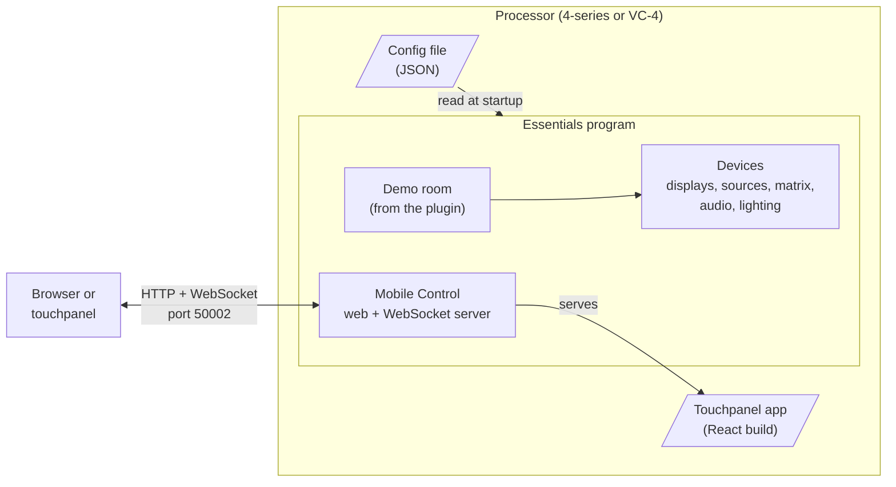

# How the demo fits together

The demo is three pieces running on one processor: the **Essentials** program, a **plugin** with the room's logic, and a **web app** for the touchpanel. A **config file** ties them together. This page explains what each piece does and how they talk to each other.

## The pieces



**Essentials** is the program you load. It's the same compiled program in every Essentials system. At startup it:

1. loads any plugins it finds;
2. reads the config file;
3. creates every device and room listed in it;
4. starts Mobile Control, which serves the touchpanel app and keeps it in sync with the devices.

**The config file** describes the system: which devices exist, how they're connected (tie lines), what the room offers (source, destination and audio lists), and the room's settings. It plays the role that a SIMPL program's device list, wiring and hard-coded values would.

**The plugin** ([EssentialsDemoRoom](https://github.com/PepperDash/EssentialsDemoRoom)) adds what the framework doesn't already have: the demo room type (`essentialsDemoRoom`) and a few simulated devices (`mockHdmiSource`, `mockRackSensor`, and a projector with screen and lift). Plugins are how Essentials is extended: new device drivers and new room types are plugins, loaded at startup without changing the framework.

**The touchpanel app** ([EssentialsDemoReactApp](https://github.com/PepperDash/EssentialsDemoReactApp)) is a React web app. The processor serves it like a small website, so anything with a browser can be a touchpanel, including a Crestron TSW panel.

## Devices, and the interfaces they share

Every device in Essentials is an object with a `key`, created from its config entry by a *factory* that matches its `type`. What a device can do is described by the **interfaces** it implements, such as:

- `IRoutingSource`: it has outputs that can be routed.
- `IHasPowerControl`: it can be powered on and off.
- `IBasicVolumeWithFeedback`: it has a volume level and mute.
- `ICommunicationMonitor`: it reports whether it's online.

The room and the UI work with these interfaces, not with specific devices. That's why a simulated display and a real one are interchangeable: both implement the same power, input and routing interfaces. It's also why the tech pages can show System Status for any device that reports its status, without knowing what kind of device it is.

## Routing: say where, not how

A route in Essentials names a **source** and a **destination**, for example "Laptop to Left Display". It doesn't name switcher inputs and outputs.

The config's **tie lines** describe the physical connections:

```
Laptop (anyOut) ──► matrix-router (source-laptop)
matrix-router (display-1) ──► Left Display (hdmiIn1)
```

When the room asks for "Laptop to Left Display", Essentials walks the tie lines backward from the display, finds the path through the matrix, and switches every device along it: the matrix's crosspoint, then the display's input. It then records the display's new current source.

The room's source list and advanced routing, and the tech Routing page, all drive the same matrix device, which is why the tech page shows routes made from the room screens.

More: [connection-based routing](https://pepperdash.github.io/Essentials/docs/technical-docs/Connection-Based-Routing.html) in the Essentials docs.

## From a tap to a switch

Mobile Control connects the UI to the devices through **messengers**. A messenger is a small adapter for one interface on one device, much like the join map between a SIMPL program and a touchpanel:

- **Commands in:** the UI sends a message such as `/room/room1/source` with a source key. The messenger calls the matching method on the room.
- **State out:** when a device's state changes, its messenger sends the new state to every connected UI.

Messengers are created automatically for the interfaces each device implements, so a new device gets UI support for everything it implements without extra wiring. The demo plugin adds its own messengers only where it has something new to say, such as the room's selected source and a source's video signal.

Following a tap on **Media Player** in basic sharing:

1. The app sends `/room/room1/source` with the source-list key `media` over the WebSocket.
2. Mobile Control's bridge for the room, part of the framework, calls the room's `RunRouteAction("media")`.
3. The room looks up `media` in its source list and runs each route in its `routeList`.
4. Essentials finds each path through the tie lines and switches the matrix and the displays.
5. Each display records Media Player as its current source. Its messenger sends that to every connected UI.
6. Every UI, in any browser or panel, updates.

More: [Mobile Control](https://pepperdash.github.io/Essentials/docs/technical-docs/Mobile-Control.html) in the Essentials docs.

## Why build a room this way

- **One program, many rooms.** A new room is a new config file, not a new program.
- **Devices are swappable.** Change a device's `type` and connection details, and the rest of the system keeps working.
- **The UI is ordinary web development.** It's built with standard tools and can run in any browser.
- **Everything is open source**, so when you need something the framework doesn't do, you can read how it works and extend it with a plugin.
